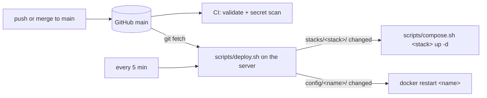

# homelab

Docker Compose setup for my home server. The `main` branch is the source of truth: the server checks it every
5 minutes and applies whatever changed.

## How it works



1. A change lands on `main`: your own commit, or a merged pull request such as a Renovate update.
2. CI checks the compose files, the Glance config and the scripts, and scans for secrets. The server does **not**
   wait for CI: protect `main` so that only green pull requests land (see [Security](#security)).
3. On the server, `scripts/deploy.sh` runs as root every 5 minutes. It fast-forwards its checkout to `origin/main`,
   lists the files changed since the last deployed commit (stored in `.last-deployed`), then:
   - `stacks/<stack>/…` changed → `up -d --remove-orphans` for that stack. Compose recreates only the containers
     whose definition changed and pulls new image versions itself.
   - `config/<name>/…` changed → `docker restart <name>`.
4. If a step fails, the commit is not marked as deployed: the next run tries again, and the scheduler reports the
   failure. A stack deleted from the repo is never torn down automatically; the run fails once and prints the
   command to run.

## Layout

```
stacks/common.env.example     variables every stack shares (paths, time zone, user, LAN IP), without values
stacks/common.env             their values, on the server only (gitignored)
stacks/<stack>/compose.yml    one Compose project per folder, named after the folder
stacks/<stack>/.env.example   the stack's own variables, without values (absent when it has none)
stacks/<stack>/.env           their values, on the server only (gitignored)
config/<name>/                files mounted into the container named <name>
scripts/                      deploy and maintenance scripts (see Scripts)
scripts/tests/                tests for the scripts
renovate.json                 image update rules
.github/workflows/            CI
docs/                         one-off runbooks and audits
```

## Conventions

The scripts rely on these. Breaking one makes something stop working, usually silently.

- **Run Compose through `scripts/compose.sh <stack> …`.** It passes `stacks/common.env` and the stack's `.env`.
  A plain `docker compose -f stacks/<stack>/compose.yml …` doesn't, and every `${VAR}` becomes empty.
- **Every service has a `container_name`.** Config folders are named after it, and `premigration_check.sh` uses it
  to find running containers.
- **`config/<name>/` belongs to the container `<name>`.** It is mounted from the checkout with a relative path
  (`../../config/<name>/…`), read-only when the app allows it. Any change in it restarts that container.
- **App data never lives in the repo or in a Docker volume.** Databases and app state go in host folders under
  `${DOCKERCONFDIR}` or `${DOCKERSTORAGEDIR}`. A Docker volume's data does not follow a container that gets
  recreated; a host folder does.
- **Every `${VAR}` a compose file uses is listed in `stacks/common.env.example` or in the stack's `.env.example`.**
  CI fails otherwise.
- **Images are pinned to an exact version.** No `latest`: what runs is what the repo says.
- **Nothing runs privileged, and only Portainer and the Docker socket proxy mount the Docker socket.** Whoever holds
  the socket is root on the server. CI enforces it; the allowlist is `DOCKER_SOCKET_SERVICES` in
  `scripts/check_stacks.sh`. A container that needs Docker information goes through the proxy, like Glance does.

## Secrets and settings

- Values live on the server, never in git, in two kinds of files (mode 600):
  - `stacks/common.env`: what every stack shares (folders, time zone, user, LAN IP).
  - `stacks/<stack>/.env`: the stack's own values, secrets included.
- Each `.env.example` is the list of keys its file must define, with a hint when the format isn't obvious. The
  deploy refuses to touch a stack while a key is missing, rather than start it with an empty value.
- Change them on the server with `sudo scripts/edit_env.sh <stack>` or `sudo scripts/edit_env.sh common`. It opens a
  copy in `$EDITOR`, checks every key is present and that Compose accepts every affected stack, then saves (the old
  file is kept as `<file>.previous`) and redeploys: that stack, or every stack for `common`. Only containers whose
  configuration changed are restarted.
- Wrap values that contain `$` (password hashes) in single quotes.
- A secret that reaches git is public, even if a later commit removes it: rotate it. gitleaks scans every push and
  pull request.

## Dashboard login

Glance asks for a login. Generate its values once with the pinned Glance image:

```sh
glance_image=$(awk '$1 == "image:" && $2 ~ /^glanceapp\/glance:/ { print $2 }' stacks/infrastructure/compose.yml)
docker run --rm --entrypoint /app/glance "$glance_image" secret:make                   # GLANCE_SECRET_KEY
docker run --rm --entrypoint /app/glance "$glance_image" password:hash 'your password'  # GLANCE_PASSWORD_HASH
```

Then `sudo scripts/edit_env.sh infrastructure`: set `GLANCE_USERNAME` (3 characters or more) and paste both values,
the hash in single quotes. The password went through your shell: clear it from the history.

## Updating apps

- Renovate opens one pull request per image or GitHub Action update. Read the linked release notes, merge, and the
  server deploys within 5 minutes.
- Some updates are held back on purpose in `renovate.json`: Postgres major versions (they need a dump/restore) and
  Immich's own database and cache images (follow Immich's release notes).
- Roll back with `git revert` and push. The previous image comes back, but an app that already migrated its
  database may refuse to start on an older version. Check the app's docs before reverting a major update.

## Common tasks

**Look at a stack.** `sudo scripts/compose.sh <stack> ps`, `sudo scripts/compose.sh <stack> logs -f <service>`.

**Change a setting.** Edit the compose file or the file under `config/`, push.

**Add a variable.** Add it to `compose.yml` and to the stack's `.env.example` (or to `stacks/common.env.example`
if every stack needs it), push, then set its value on the server with `sudo scripts/edit_env.sh <stack>` (or
`common`). Until the value exists, the deploy waits and reports the missing key.

**Add a stack.**
1. Create `stacks/<stack>/compose.yml`: a `container_name` on every service, pinned images, log rotation through
   an `x-logging` anchor like the other stacks.
2. If the stack has variables of its own, list them in `stacks/<stack>/.env.example`.
3. Put files the containers need under `config/<container_name>/`.
4. Push. If the stack has an `.env.example`, the deploy reports that its `.env` is missing:
   `sudo scripts/edit_env.sh <stack>` creates it and starts the stack.

**Remove a stack.** Delete its folder and push. The next deploy prints `docker compose -p <stack> down`: run it
when you are ready. Data folders are left alone.

**Replace containers started some other way** (another tool, an old compose file): run
`sudo scripts/premigration_check.sh <stack>` first. It compares the running containers with what the stack would
create: mounts, Docker volumes, environment variable names, image versions.
[docs/migration-from-portainer.md](docs/migration-from-portainer.md) is the full procedure used for this server.

## Scripts

| Script | Where and when | What it does |
|---|---|---|
| `deploy.sh` | server, scheduler, root | pulls `main` and redeploys what changed |
| `compose.sh <stack> …` | server, by hand and from the other scripts | `docker compose` with the stack's env files |
| `edit_env.sh <stack>\|common` | server, by hand | edits settings and secrets, validates, redeploys |
| `premigration_check.sh <stack>` | server, by hand | compares running containers with the compose file |
| `cleanup_deluge.sh` | server, scheduler | removes orphaned torrents; needs `SONARR_API_KEY` and `RADARR_API_KEY` in its environment (source `stacks/media/.env`); `DRY_RUN=1` to simulate |
| `check_stacks.sh` | anywhere, CI | validates every stack against the `.env.example` files and the privilege rules |
| `check_glance_config.sh` | anywhere, CI | validates `config/glance` with the pinned Glance image (pulls it) |
| `lib.sh` | sourced by the others | shared helpers |
| `migration_helpers.sh` | server, sourced, once | helpers used by the Portainer migration runbook |

## Tests and CI

```sh
bash scripts/check_stacks.sh
for test_file in scripts/tests/*_test.sh; do bash "$test_file"; done
bash scripts/check_glance_config.sh    # pulls the Glance image
```

The tests run each script through its real entry point. `docker` and `curl` are replaced by stubs, except in the
`check_stacks.sh` tests, which use the real `docker compose config` (nothing is pulled or started); git remotes are
throwaway repositories. They need bash, git, jq, flock and Docker Compose.

CI (`.github/workflows/validate.yml`) runs all of it on every push and pull request, plus gitleaks.

## Security

- Anyone who can push to `main` runs code as root on the server within 5 minutes. Keep 2FA on the GitHub account,
  never enable Renovate automerge, and protect `main` so every change goes through a pull request whose checks
  pass (you can still merge your own):
  ```sh
  gh api -X PUT repos/Androlax2/homelab/branches/main/protection --input - <<'JSON'
  {
    "required_status_checks": {"strict": true, "contexts": ["stacks", "glance-config", "scripts", "secrets"]},
    "enforce_admins": true,
    "required_pull_request_reviews": {"required_approving_review_count": 0},
    "restrictions": null,
    "allow_force_pushes": false,
    "allow_deletions": false
  }
  JSON
  ```
- `docs/audits/` holds maintainability audits only. Security reviews are not committed: this repository is public.

## Setting up a server

1. Install Docker with a Compose that accepts several `--env-file` flags, plus git, jq and flock.
2. Clone the repo as root. LinuxServer images only run custom init scripts that are owned by root
   (`config/prowlarr/mods`).
3. `sudo scripts/edit_env.sh common`, then `sudo scripts/edit_env.sh <stack>` for every stack that has an
   `.env.example` (each one starts its stack). Generate the dashboard login first (see above).
4. Run `sudo scripts/deploy.sh` once. The first run treats every file as changed, starts the remaining stacks and
   writes `.last-deployed`.
5. Schedule `scripts/deploy.sh` every 5 minutes as root, with a notification when it exits non-zero.

## Troubleshooting

- **The deploy reports `.env is missing` or `lacks keys`**: `sudo scripts/edit_env.sh <stack>` (or `common`).
- **Compose warns that a variable "is not set", or containers get empty values**: it was run as a plain
  `docker compose`; use `scripts/compose.sh <stack> …`.
- **`git merge --ff-only` fails**: the server's checkout has local edits, or `main` was rewritten (force push).
  Check with `git -C <checkout> status`; if nothing local matters, `git -C <checkout> reset --hard origin/main`.
- **A file under `config/` changed but the app didn't pick it up**: the folder name must equal the container's
  `container_name`.
- **The dashboard won't start**: Glance refuses a config with an unset variable or an incomplete login; its log
  (`sudo scripts/compose.sh infrastructure logs glance`) names it.
- **The deploy keeps failing on the same commit**: the scheduler's output has the error; nothing is marked as
  deployed until it succeeds.
